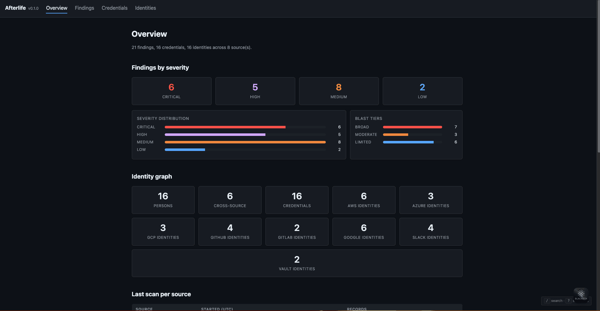
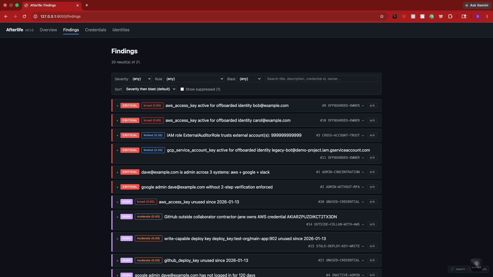
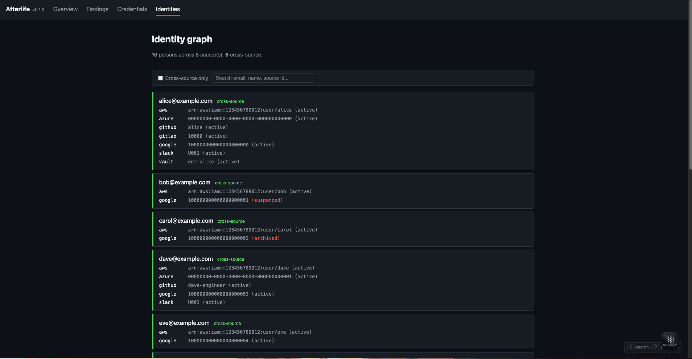
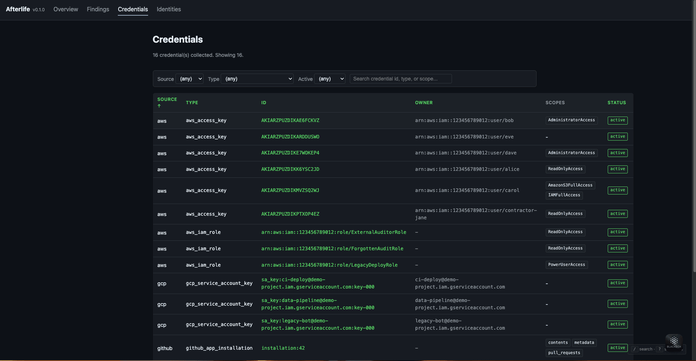
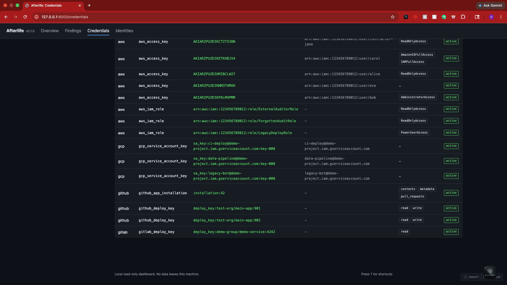
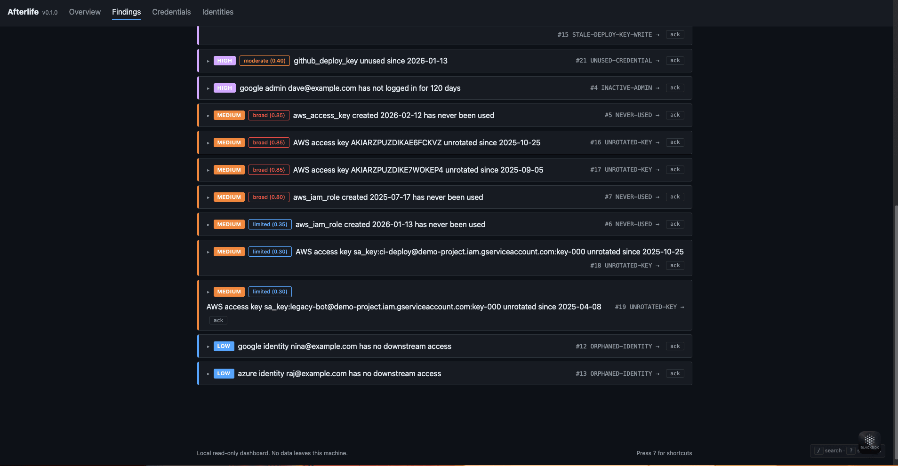
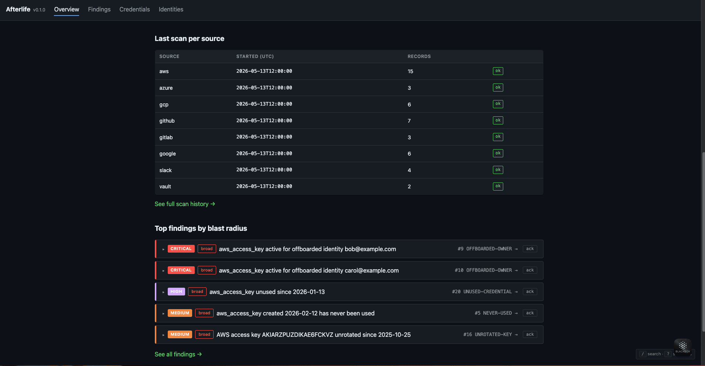
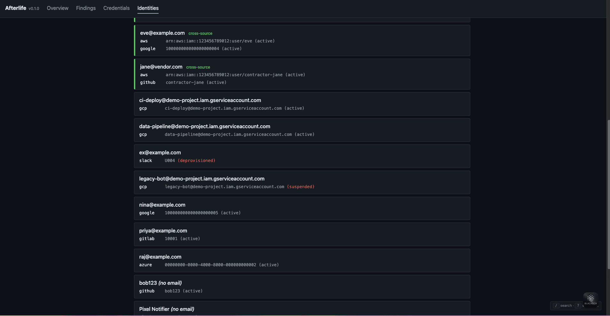
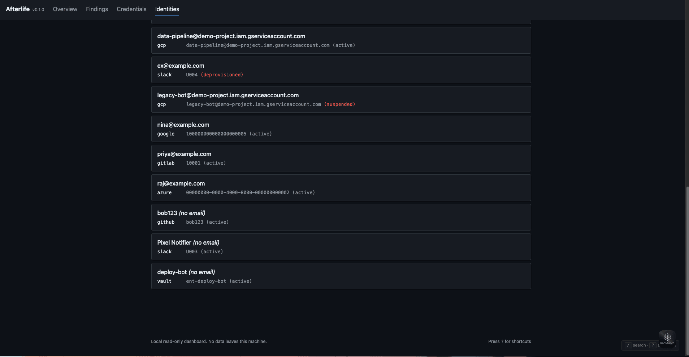
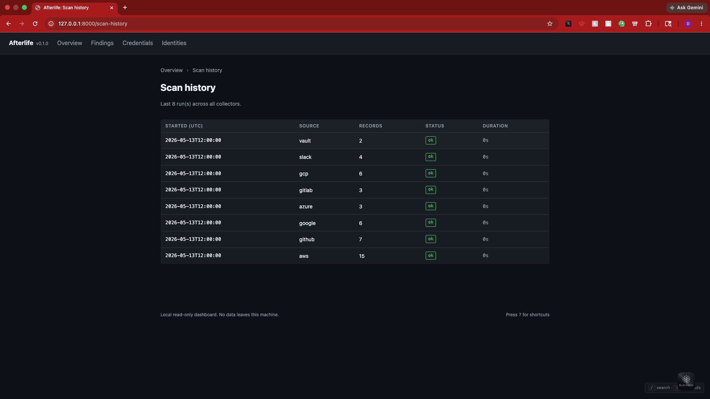

# Afterlife

> Credentials that outlive their owners.


**Afterlife** is a ghost-access auditor. It pulls identities and credentials
from your cloud, code, IdP, and SaaS systems into one identity graph, then
runs detection rules over that graph and ranks findings by blast radius.

The class of credentials it surfaces drives a disproportionate share of modern
breaches: every API key generated by a contractor who left two years ago,
every OAuth grant tied to a deprovisioned employee, every long-lived AWS
access key on an account marked "suspended" in the IdP. Uber 2022, Okta 2023,
MOVEit, Snowflake 2024 all involve some version of this.

Most tools treat each system in isolation. Afterlife's value is the
**cross-source identity graph**: an AWS access key's "owner" might be active
in AWS but suspended in Google Workspace; without joining the two views, you
miss it.

## Status

`v0.1`. 8 source systems collected, 11 detection rules, 250+ tests.

## Source systems

| | |
|---|---|
| **Cloud** | AWS IAM, GCP IAM |
| **Code hosting** | GitHub, GitLab |
| **Identity providers** | Google Workspace, Microsoft Entra ID, Okta |
| **Operational** | Slack, HashiCorp Vault |

Each collector lives in `src/afterlife/collectors/`. They are intentionally
dumb (no analysis), idempotent (re-run safe), and tested against mocked APIs
(no live calls in CI). Vault's `aliases` field is used to add cross-system
graph edges directly, even without shared email.

## What it detects

| Rule | Severity | What it catches |
|------|----------|-----------------|
| `OFFBOARDED-OWNER` | Critical | Active credential whose owner (or any cross-source linked identity) is suspended/archived/deleted in an IdP. The Uber-2022 pattern. |
| `CROSS-ACCOUNT-TRUST` | Critical | IAM role trusts an external AWS account. The Capital-One-2019 precondition. |
| `ADMIN-CONCENTRATION` | Critical | Same person holds admin-tier access in 2+ systems (IdP admin flag + AWS AdministratorAccess + ...). |
| `ADMIN-WITHOUT-MFA` | Critical | Google Workspace admin without 2-step verification enforced. |
| `UNUSED-CREDENTIAL` | High | Active credential not used in N days (default 90). |
| `STALE-DEPLOY-KEY-WRITE` | High | Write-capable deploy key not used in N days. |
| `OUTSIDE-COLLAB-WITH-AWS` | High | GitHub outside collaborator linked to active AWS credentials. |
| `INACTIVE-ADMIN` | High | Admin who hasn't logged in within the inactivity window. |
| `UNROTATED-KEY` | Medium | Long-lived static cloud key (AWS / GCP) past the rotation threshold. |
| `NEVER-USED` | Medium | Active credential past the grace period with no usage record. |
| `ORPHANED-IDENTITY` | Low | IdP identity with no downstream system presence (hygiene signal). |

Each rule's logic, false-positive notes, and remediation are in
[docs/DETECTIONS.md](docs/DETECTIONS.md).

## Quickstart

Zero-config demo against in-memory mocks for all 8 source systems:

```bash
make install
make demo
```

The demo plants synthetic users, credentials, and IdP records across every
collector, runs them, and produces 20 deterministic findings with one
`OFFBOARDED-OWNER` (bob, broad blast) and one `ADMIN-CONCENTRATION` (dave is
admin in 3 systems). Identity graph: 16 persons across 8 sources, 6
cross-source. Demo also writes `.afterlife-demo-report.html` you can open in
a browser.

Against real systems:

```bash
make install
.venv/bin/afterlife init
.venv/bin/afterlife scan aws --profile my-profile
.venv/bin/afterlife scan gcp --project my-project
.venv/bin/afterlife scan github --org my-org --token $GITHUB_TOKEN
.venv/bin/afterlife scan gitlab --group my-group --token $GITLAB_TOKEN
.venv/bin/afterlife scan idp --provider google     # or okta / azure
.venv/bin/afterlife scan slack --token $SLACK_TOKEN
.venv/bin/afterlife scan vault --api-url https://vault.example.com:8200
.venv/bin/afterlife analyze --allowlist allowlist.yaml
.venv/bin/afterlife identities
.venv/bin/afterlife report --format html -o report.html
.venv/bin/afterlife serve                          # localhost dashboard
```

See [.env.example](.env.example) for required environment variables.

## Reports

`afterlife report` emits four formats. Each carries the same finding set;
choose based on consumer.

| Format | Use it for |
|--------|------------|
| `json` | Programmatic consumption, scripting, pipelines |
| `html` | Self-contained audit handout, attach to a PR or email |
| `pdf` | Publication-ready handout for stakeholders (requires `[pdf]` extra and Pango) |
| `sarif` | GitHub Code Scanning, Azure DevOps, GitLab security feeds |

```bash
.venv/bin/afterlife report --format pdf -o audit.pdf
```

## Web dashboard

`afterlife serve` launches a local FastAPI dashboard with seven pages.

<p>
  
  
  
</p>

<details>
<summary>More screenshots</summary>

| Credentials across all sources | Credentials, continued |
|---|---|
|  |  |

| Findings (medium / low tiers, orphaned identities) | Overview, bottom (top findings by blast radius) |
|---|---|
|  |  |

| Identities, mixed-source middle | Identities, single-source bottom (bots, no-email cases) |
|---|---|
|  |  |

Every scan run captured by the operational scan-history page:



</details>

The pages:

- **Overview**: severity tiles, blast-tier chart, last-scan-per-source.
- **Findings**: filterable, searchable, sortable, expandable evidence + remediation, one-click `ack` per finding (state in localStorage), HTMX-powered live filtering.
- **Credentials**: sortable table with source / type / active filters, click into per-credential detail.
- **Identities**: person-grouped, filterable to cross-source only, click into per-person detail showing all linked identities + owned credentials + active findings.
- **Finding / Credential / Person detail pages**: deep-linked, fully cross-referenced.
- **Scan history**: every `afterlife scan ...` run with start/end/duration/status.

The dashboard is **read-only**: no DB writes, no auth, hardened with a strict
CSP, `X-Frame-Options: DENY`, `X-Content-Type-Options: nosniff`,
`Cross-Origin-Opener-Policy: same-origin`, disabled OpenAPI/docs endpoints,
and self-hosted HTMX (no CDN). Dark mode follows
`prefers-color-scheme`. Keyboard shortcuts (`/` to search, `g h/f/c/i` to
navigate, `?` for help). Includes a print stylesheet for PDF-via-browser.

## CI integration

```yaml
# .github/workflows/afterlife.yml (excerpt)
- run: afterlife report --format sarif -o afterlife.sarif
- uses: github/codeql-action/upload-sarif@v3
  with:
    sarif_file: afterlife.sarif
```

Full workflow at [.github/workflows/afterlife.yml](.github/workflows/afterlife.yml).
It assumes an AWS role via OIDC, scans every source the team uses, uploads
SARIF to Code Scanning, and saves an HTML report as a 30-day artifact.

## Allowlist / suppression

`afterlife analyze --allowlist allowlist.yaml` reads a YAML file naming
findings to suppress. Suppressed findings are persisted (still auditable) but
hidden from the default dashboard view. Example:

```yaml
- rule_id: NEVER-USED
  credential_id: arn:aws:iam::123:role/SeasonalReportingRole
  reason: Yearly audit role, intentionally dormant
  until: 2027-01-01
```

Matchers: `rule_id`, `credential_id`, `identity_source`, `identity_id`. All
named fields must match. Catch-all entries (no matchers) are refused at load
time.

## Architecture

```
  collectors/  ─►  SQLite  ─►  identity graph  ─►  rules engine  ─►  blast scoring  ─►  reports
   AWS / GCP                   (NetworkX,           (pluggable)        (per-finding)     (json/html
   GitHub / GitLab              email + Vault                                             /sarif/pdf)
   Google / Okta / Azure        aliases)
   Slack / Vault
```

Five layers, each with a narrow boundary. Collectors write to SQLite only.
Rules read from SQLite + identity graph only. Scoring is pure (input:
credential, output: blast radius). Reports are pure (input: DB, output:
text). The dashboard wraps the same readers behind FastAPI. Details in
[docs/ARCHITECTURE.md](docs/ARCHITECTURE.md).

## Project layout

```
src/afterlife/
├── collectors/    8 collectors, one file each
├── rules/         11 detection rules, one file each, decorator-registered
├── graph/         Identity graph (NetworkX), email + Vault-alias linking
├── scoring/       Blast-radius scoring with explainable factors
├── reporting/     JSON, HTML, SARIF, PDF
├── web/           FastAPI dashboard + templates + static assets
├── allowlist.py   YAML suppression loader + matcher
├── scan_runs.py   Run-tracking context manager
├── db.py          SQLite schema + helpers
├── models.py      Identity, Credential, Finding, BlastRadius
└── cli.py         Typer CLI

tests/             250+ tests using moto, respx, freezegun, fastapi.testclient
demo/              Self-contained `make demo` (mocks for every collector)
docs/              ARCHITECTURE.md, DETECTIONS.md, INTERVIEW_TALK_TRACK.md
.github/workflows  Production-ready GitHub Action
```

## Further reading

- [docs/ARCHITECTURE.md](docs/ARCHITECTURE.md): layered design + why these boundaries
- [docs/DETECTIONS.md](docs/DETECTIONS.md): every rule, false-positive notes, remediation
- [docs/blog/the-graph-layer.md](docs/blog/the-graph-layer.md): design essay on why a graph is the right shape for cross-source ghost-access detection
- [docs/INTERVIEW_TALK_TRACK.md](docs/INTERVIEW_TALK_TRACK.md): prepared narratives for portfolio conversations
- [CHANGELOG.md](CHANGELOG.md): v0.1 milestone history

## Why "Afterlife"

The credentials this tool finds shouldn't still be alive.

## License

MIT
